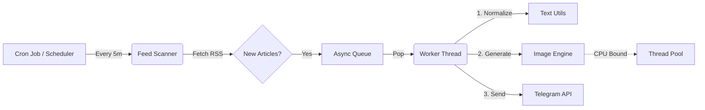

# 📰 Async Economic Times News Bot

> **A high-performance, asynchronous Telegram bot that monitors stock market news in real-time.**
> *Built for speed, reliability, and visual engagement.*


---

## 🚀 Features

### ⚡ **High-Performance Architecture**
- **AsyncIO Core**: Built on `aiohttp` and `python-telegram-bot` for non-blocking operations.
- **Smart Queue System**: Decouples "Scanning" (Producer) from "Sending" (Consumer).
    - *Scanner*: Checks feeds instantly, queues items, and sleeps to save resources.
    - *Worker*: Processes the queue in the background continuously.
- **Persistent Sessions**: Reuses HTTP connections (Keep-Alive) to reduce latency by ~40%.
- **Robust Headers**: Anti-caching logic ensures you always get the freshest news.

### 🎨 **Enhanced Visuals**
- **Premium Image Generation**: Creates stunning, dynamically sized news cards with custom fonts and branding.
- **Optimized Rendering**: Uses a "Downscale-Blur-Upscale" pipeline for high-quality backgrounds with minimal CPU usage (5-10x faster).
- **Clean Logs**: Beautiful, color-coded dashboard logs using a custom `ModernConsoleFormatter`.

### 🛡️ **Reliability & Logic**
- **Smart Deduplication**: Checks both Hash and Title to prevent duplicate news.
- **Text Normalization**: Intelligently converts `wo**rs**t` -> `worst` but `Rs 500` -> `INR 500`.
- **Flood Control**: Automatically handles Telegram rate limits with exponential backoff.
- **Resilient**: Graceful error handling for network drops andtimeouts.

---

## 🏗️ Architecture



---

## 🛠️ Installation

### 1. Prerequisites
- Python 3.9+
- A Google Font (optional, auto-downloaded)

### 2. Setup
Clone the repository and install dependencies:

```bash
git clone https://github.com/yourusername/ET_NEWS_BOT.git
cd ET_NEWS_BOT
pip install -r requirements.txt
```

### 3. Configuration
Create a `.env` file in the root directory:

```ini
# Telegram Credentials
TELEGRAM_BOT_TOKEN=123456:ABC-DEF1234ghIkl-zyx57W2v1u123ew11
TELEGRAM_CHANNEL_ID=@your_channel_name

# App Settings
CHECK_INTERVAL_MINUTES=5
MAX_ARTICLES_PER_CHECK=5
DATABASE_PATH=news_tracker.db

# Optional: Instant View
IV_RHASH=your_instant_view_rhash
```

---

## 🏃‍♂️ Usage

Run the bot:

```bash
python news_telegram_bot.py
```

**You will see the new Dashboard Log:**
```text
╭──────────────────────────────────────────────────╮
│              ET NEWS BOT STARTED                 │
├──────────────────────────────────────────────────┤
│ Time (IST):     10:30:00                         │
│ Mode:           Async / Worker (3 Threads)       │
│ Status:         🟢 Online & Monitoring           │
╰──────────────────────────────────────────────────╯
```

### Commands
- `/start` - Check if bot is alive.
- `/stats` - View queue size, total sent, and failure metrics.

---

## 📂 Project Structure

| File | Description |
| :--- | :--- |
| `news_telegram_bot.py` | **Main Entry Point**. Handles the Async Loop, Scheduler, and Telegram logic. |
| `image_generator.py` | **Graphics Engine**. Generates the news images. |
| `text_utils.py` | **NLP Utility**. Handles summarization, cleaning, and currency logic. |
| `logging_config.py` | **Logger**. Provides the beautiful console output and file rotation. |
| `config.py` | **Settings**. Loads variables from `.env`. |

---

## 🔧 Troubleshooting

- **Telegram Timeout?** The bot uses robust 30s timeouts. Check your internet speed if this persists.
- **Missing Articles?** Check logs for `⏭️ Skipping Duplicate Title`. This means the bot intentionally ignored it.
- **"Rs" Issues?** Run `test_currency.py` (if available) or check `text_utils.py`. The legacy issue with "worst" -> "woINRt" is **FIXED**.

---

<p align="center">
  <i>Built with ❤️ for Traders</i>
</p>
